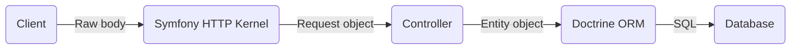

# Doctrine Helper Bundle

## About

Doctrine Helper Bundle is a Symfony 6.x bundle that provides a few functionalities that simplify the development of request handling logics that involve interacting with data going to and coming out of the database via the popular Doctrine ORM library.

## Getting Started

Run the composer require command:

```bash 
composer require mlukman/doctrine-helper-bundle
```

And add into the array within `config/bundles.php`:

```php
MLukman\DoctrineHelperBundle\DoctrineHelperSymfonyBundle::class => ['all' => true],
```

## Functionalities Provided

### 1. Consolidation of common Doctrine operations in DataStore service

Most of the Doctrine operations require chaining a few function calls, like for example:

```php
$count = $em->getRepository(Comment::class)
    ->createQueryBuilder('c')
    ->select('COUNT(1)')
    ->where('email = :email')
    ->setParameter('email', $email)
    ->getQuery()
    ->getSingleScalarResult();
```

The `DataStore` service provided by this bundle has simplified this operation into:

```php
$count = $ds->count(Comment::class, ['email' => $email]);
```

The following are operations that `DataStore` has simplified:

| #    | Operation                                                    | Pure Doctrine                                                | Using DataStore                                              |
| ---- | ------------------------------------------------------------ | ------------------------------------------------------------ | ------------------------------------------------------------ |
| 1    | Query the record with a specific ID                          | $em<br />->getRepository(Comment::class)<br />->find(3);     | $ds->queryOne(Comment::class, 3);                            |
| 2    | Query latest record of Comment with a specific email         | $em<br />->getRepository(Comment::class)<br />->findOneBy(['email' => $email], ['date'=>'DESC']); | $ds->queryOne(Comment::class, ['email' => $email], ['date'=>'DESC']); |
| 3    | Query up to 10 latest records of Comment with a specific email | $em<br />->getRepository(Comment::class)<br />->findBy(['email' => $email], ['date'=>'DESC'], 10); | $ds->queryMany(Comment::class, ['email' => $email], ['date'=>'DESC'], 10); |
| 4    | Query using OR conditions                                    | $em<br />->getRepository(Comment::class)<br/>->createQueryBuilder('c')<br />->where('e.email = :email')<br />->orWhere('e.name = :name')<br />->setParameter('email', $email)<br />->setParameter('name', $name)<br />->setMaxResults($limit)<br />->addOrderBy('e.date', 'DESC')<br />->getQuery()<br />->getResult() | $ds->queryUsingOr(Comment::class, ['email' => $email, 'name' => $name], ['created' => 'DESC'], $limit); |

### 2. Conversion of request body into objects

Common request body handling flow is as below.



Inside the controller, there would be many lines of code that manually read parameters one by one from the Request object and transfer it into the corresponding Entity object. What if the controller can just call a single line of code to do so?

```php
$specificRequest->populate($specificEntity);
```

This helper bundle has `Service\RequestBodyConverter` which does that!

First, create a PHP class that extends`DTO\RequestBody`, for example:

```php
class CommentRequest extends RequestBody
{
    public ?string $name;
    public ?string $email;
    public ?string $comment;
}
```

For simplicity, just let all its properties `public` instead of using setters/getters.

Next, modify the corresponding Entity class to implement `DTO\RequestBodyTargetInterface`. For now there is no method to implement and this interface is just for type-detection. However, the Entity class must either have public properties with the same names as the ones inside the `DTO\RequestBody` subclass or corresponding setter methods or mixture of both. Otherwise the parameters from the request will be ignored. For example:

```php
#[ORM\Entity]
class Comment implements RequestBodyTargetInterface
{
    #[ORM\Id]
    #[ORM\GeneratedValue]
    #[ORM\Column]
    private ?int $id = null;

    #[ORM\Column(length: 30)]
    public ?string $name = null;

    #[ORM\Column(length: 30)]
    public ?string $email = null;

    #[ORM\Column(type: Types::TEXT, nullable: true)]
    private ?string $comment = null;

    public function setComment(string $comment): self
    {
        $this->comment = $comment;
        return $this;
    }
}
```

Finally, modify the controller method by doing:

- Add the `RequestBody` subclass to the list of the method parameters. Make it optional by prepending the class name with `?`.

  ```php
  #[Route('/comments/post', name: 'app_comments_post')]
  public function comments_post(?CommentRequest $commentRQI): Response
  ```

- Add the code to use this `RequestBody` subclass (sorry, it's not really a single line of code if you count in the entity instantiation and the condition checking but the transfer of values from the request into the entity is actually that single line).
  ```php
  $comment = new Comment();
  if ($commentRQI) {
      $commentRQI->populate($comment);
  }
  ```

Now, any requests coming to that route with POST or PUT bodies, either in JSON format or HTTP form submission, will be converted into the specific method parameter and will be able to be utilized by the controller method.

Note: to troubleshoot any conversion issues, this bundle provides a web profiler panel with label "Request Conversions".

### 3. Custom types for storing & retrieving files and images in database BLOB column

While Doctrine ORM does provide column type for BLOB, to use the such columns to store images and files still require manually reading them from files. Also, any enhancements on images need to be manually done. As for files, should we need to store information such as the file name, size and mime type, those information will need to occupy separate and dedicated columns in the database table alongside the BLOB column.

The bundle comes with custom column types to represent images and files in the database as well as classes which are fine-tuned for handling images and files, as below:

```php
#[ORM\Entity]
class Profile
{
    #[ORM\Column(type: "image", nullable: true)]
    private ?ImageWrapper $photo = null;    
    
    #[ORM\Column(type: "file", nullable: true)]
    private ?FileWrapper $resume = null;    

}
```


#### 3.1 Column type 'image' & class ImageWrapper

To store images in the database, we can simply use the column type "image" in the `ORM\Column` annotation. The corresponding PHP class is `ImageWrapper` which basically wraps around the `Imagine` library (https://imagine.readthedocs.io/). This bundle performs conversion between the database `BLOB` columns and PHP `ImageWrapper` objects. 

The recommended usage of `ImageWrapper` class is to use it in conjunction with  `DTO\RequestBody`  to handle form submissions. Specifying a property whose name matches with the upload field's `name` will automatically load the image from the form submissions. 

#### 3.2 Column type 'file' & class FileWrapper   

Unlike images where the only data that matters is the imagery information, storing files in the database usually also involves storing the file name and mime type as well in order for the stored file data to be useful later. These additional metadata are often stored in separate database columns, which add up the complexity of the application to combine and split those information upon reading and writing to the database. To simplify this issue, this bundle provides the column type "file" and its corresponding PHP class `FileWrapper`. 

Using this class in conjunction with  `DTO\RequestBody`  will automatically process file upload field submissions and populate the file metadata, which can be retrieved using `getName()`, `getMimetype()`, `getSize()` and `getContent()`.

### 4. Record list filtration

#### 4.1 Pagination

When our applications handle a long list of a particular entity data, it is often a challenge to present the list of data to the users. Simply listing all of them would not only impact the performance of the applications, it would also become bad experience to the users who need to scroll through all of them. A common technique is to paginate the list into reasonable chunk and provide the users with the UI elements to navigate through the pages. While this bundle does not provide the UI elements in order to be UI framework agnostic, it provides the functionalities to process the pagination parameters from the query parameters, use them to add filtration to database queries and prepare the information that will be required by the Twig template to show the correct pagination control UI elements.

To start with the pagination, the first step is to add a `DTO\Paginator` object to the controller's method, for example:

```php
#[Route('/admin/users', name: 'app_admin_users')]
public function users(Paginator $paginator): Response
```

Next is to prepare a `\Doctrine\ORM\QueryBuilder` pre-configured with the base query and any default filters and sorting, for example:

```php
#[Route('/admin/users', name: 'app_admin_users')]
public function users(Paginator $paginator, EntityManagerInterface $em): Response
{
    $qb = $em->getRepository(User::class)->createQueryBuilder('u')
        ->andWhere("u.status = 'Active'")
        ->addOrderBy('u.registered', 'DESC');
}
```

Now let's the paginator do the magic by simply calling `paginateResults()` method, passing the query builder in the parameter:

```php
#[Route('/admin/users', name: 'app_admin_users')]
public function users(Paginator $paginator, EntityManagerInterface $em): Response
{
    $qb = $em->getRepository(User::class)->createQueryBuilder('u')
        ->andWhere("u.status = 'Active'")
        ->addOrderBy('u.registered', 'DESC');
    return $this->render('admin/users/index.html.twig', [
        'users' => $paginator->paginateResults($qb),
        'paginator' => $paginator,
    ]);
}
```

Finally, we need to prepare the UI elements that will show the pagination control. The `$paginator` object that we provide to the Twig template in the example above provides a few method that will provide the necessary info:

| Method         | Description                                                  |      |
| -------------- | ------------------------------------------------------------ | ---- |
| `getMaxPage()` | The number of pages to navigate between. It is also a good idea to hide the pagination control if this value is 1. |      |
| `getPage()`    | The current page number starting from 1 up until `getMaxPage()` value. This value is processed from the query parameter `page`, which the pagination control needs to modify upon navigation. |      |
| `getLimit()`   | The number of records in one page. This value is processed from the query parameter `limit`, which the pagination control needs to modify upon navigation. |      |
| `getFrom()`    | The index of the first record in the current page. For example, on the 2nd page with limit 10, the value would be 11. |      |
| `getTo()`      | The index of the last record in the current page. For example, on the 2nd page with limit 10, the value would be 20 (assuming there are 20 or more records in total). |      |

#### 4.2 Search

Another common method of record list filtration is by allowing users to search a specific keyword. This bundle simplifies adding that functionality by providing `DTO\SearchQuery` that is to be added to the controller's method, for example:

```php
#[Route('/admin/comments', name: 'app_admin_comments')]
public function comments(SearchQuery $search): Response
```

Next is to prepare a `\Doctrine\ORM\QueryBuilder` pre-configured with the base query and any default filters and sorting, for example:

```php
#[Route('/admin/comments', name: 'app_admin_comments')]
public function comments(SearchQuery $search): Response
{
    $qb = $em->getRepository(Comment::class)->createQueryBuilder('c')
        ->andWhere("c.deleted = 0")
        ->addOrderBy('c.posted', 'DESC');
}
```

Next, let the `DTO\SearchQuery` do the magic by calling either `applyLikeSearch()` or `applyFulltextSearch()` passing the query builder as the first parameter and a list of columns with aliases as the second parameter:

```php
#[Route('/admin/comments', name: 'app_admin_comments')]
public function comments(SearchQuery $search): Response
{
    $qb = $em->getRepository(Comment::class)->createQueryBuilder('c')
        ->andWhere("c.deleted = 0")
        ->addOrderBy('c.posted', 'DESC');
    $search->applyFulltextSearch($qb, ['c.message']);
}
```

Then, pass the query builder result and the `SearchQuery` object to Twig template:

```php
#[Route('/admin/comments', name: 'app_admin_comments')]
public function comments(SearchQuery $search): Response
{
    $qb = $em->getRepository(Comment::class)->createQueryBuilder('c')
        ->andWhere("c.deleted = 0")
        ->addOrderBy('c.posted', 'DESC');
    $search->applyFulltextSearch($qb, ['c.message']);
    return $this->render('admin/comments/index.html.twig', [
        'comments' => $qb->getQuery()->getResult(),
        'searchquery' => $search,
    ]);
}
```

Finally, prepare a search field in the UI:

```twig
<input type="search" name="{{ searchquery.name }}" value="{{ searchquery.keyword }}" />
```

#### 4.3 Pre-defined Queries

Another method of record list filtration is by providing users a set of predefined filters such as filter by statuses, categories etc. This bundle provides such functionality via `PDO\PreDefinedQueries`. Again, like `Paginator` and `SearchQuery`, the UI elements for displaying the filters are not provided but it should be simple to do.

To start, add a `DTO\PreDefinedQueries` object to the controller's method, for example:

```php
#[Route('/admin/assets', name: 'app_admin_assets')]
public function assets(PreDefinedQueries $status): Response
```

Next is to prepare a `\Doctrine\ORM\QueryBuilder` pre-configured with the base query and any default filters and sorting, for example:

```php
#[Route('/admin/assets', name: 'app_admin_assets')]
public function assets(PreDefinedQueries $status): Response
{
    $qb = $em->getRepository(Asset::class)->createQueryBuilder('a')
        ->addOrderBy('a.registered', 'DESC');
}
```

Next, we need to define for each of the filter option the name and how it modifies the query builder. To do so, call the `addQuery()` method, passing the name of the filter option and a callback that accepts the query builder to perform modifications. Call that method for each filter option (chainable) and finally call the `apply()` method passing the prepared query builder for example:

```php
#[Route('/admin/assets', name: 'app_admin_assets')]
public function assets(PreDefinedQueries $status): Response
{
    $qb = $em->getRepository(Asset::class)->createQueryBuilder('a')
        ->addOrderBy('a.registered', 'DESC');
    $status
        ->addQuery('all', fn(QueryBuilder $qb) => $qb)
        ->addQuery('active', fn(QueryBuilder $qb) => $qb->andWhere("a.status = 'Active'"))
        ->addQuery('inactive', fn(QueryBuilder $qb) => $qb->andWhere("a.status IN ('Disposed', 'Consumed')"))
        ->apply($qb);
}
```

Then, pass the query builder result and the `SearchQuery` object to Twig template:

```php
#[Route('/admin/assets', name: 'app_admin_assets')]
public function assets(PreDefinedQueries $status): Response
{
    $qb = $em->getRepository(Asset::class)->createQueryBuilder('a')
        ->addOrderBy('a.registered', 'DESC');
    $status
        ->addQuery('all', fn(QueryBuilder $qb) => $qb)
        ->addQuery('active', fn(QueryBuilder $qb) => $qb->andWhere("a.status = 'Active'"))
        ->addQuery('inactive', fn(QueryBuilder $qb) => $qb->andWhere("a.status IN ('Disposed', 'Consumed')"))
        ->apply($qb);
    return $this->render('admin/assets/index.html.twig', [
        'assets' => $qb->getQuery()->getResult(),
        'filter' => $status,
    ]);    
}
```

Finally, prepare the UI elements that provides a list of filter options which navigates to specific URLs upon interaction. For example, using a simple `<a>`, `<ul>` and `<li>`:

```twig
<ul>
    
        <li>
            <a href="{{ url }}">
                
                    <strong>{{ id }}</strong>
                
                    {{ id }}
                
            </a>
        </li>
    
</ul>
```


