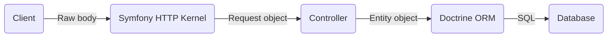

# Doctrine Helper Bundle

[](https://packagist.org/packages/mlukman/doctrine-helper-bundle) [](https://packagist.org/packages/mlukman/doctrine-helper-bundle) [](https://github.com/MLukman/DoctrineHelperBundle)

## About

Doctrine Helper Bundle is a Symfony 7.x bundle that provides a few functionalities that simplify the development of request handling logics that involve interacting with data going to and coming out of the database via the popular Doctrine ORM library.

## Installation

Make sure Composer is installed globally, as explained in the [installation chapter](https://getcomposer.org/doc/00-intro.md) of the Composer documentation.

### Applications that use Symfony Flex

Open a command console, enter your project directory and execute:

```shell
composer require mlukman/doctrine-helper-bundle
```

### Applications that don't use Symfony Flex

#### Step 1: Download the Bundle

Open a command console, enter your project directory and execute the
following command to download the latest stable version of this bundle:

```shell
composer require mlukman/doctrine-helper-bundle:1.*
```

#### Step 2: Enable the Bundle

Then, enable the bundle by adding it to the list of registered bundles
in the `config/bundles.php` file of your project:

```php
// config/bundles.php

return [
    // ...
    MLukman\DoctrineHelperBundle\DoctrineHelperBundle::class => ['all' => true],
];
```

## Functionalities Provided

### 1. Consolidation of common Doctrine operations in DataStore service

Most of the Doctrine operations require chaining a few function calls, like for example:

```php
$count = $em->getRepository(Comment::class)
    ->createQueryBuilder('c')
    ->select('COUNT(1)')
    ->where('email = :email')
    ->setParameter('email', $email)
    ->getQuery()
    ->getSingleScalarResult();
```

The `DataStore` service provided by this bundle has simplified this operation into:

```php
$count = $ds->count(Comment::class, ['email' => $email]);
```

The following are operations that `DataStore` has simplified:

| #    | Operation                                                    | Pure Doctrine                                                | Using DataStore                                              |
| ---- | ------------------------------------------------------------ | ------------------------------------------------------------ | ------------------------------------------------------------ |
| 1    | Query the record with a specific ID                          | $em<br />->getRepository(Comment::class)<br />->find(3);     | $ds->queryOne(Comment::class, 3);                            |
| 2    | Query latest record of Comment with a specific email         | $em<br />->getRepository(Comment::class)<br />->findOneBy(['email' => $email], ['date'=>'DESC']); | $ds->queryOne(Comment::class, ['email' => $email], ['date'=>'DESC']); |
| 3    | Query up to 10 latest records of Comment with a specific email | $em<br />->getRepository(Comment::class)<br />->findBy(['email' => $email], ['date'=>'DESC'], 10); | $ds->queryMany(Comment::class, ['email' => $email], ['date'=>'DESC'], 10); |
| 4    | Query using OR conditions                                    | $em<br />->getRepository(Comment::class)<br/>->createQueryBuilder('c')<br />->where('e.email = :email')<br />->orWhere('e.name = :name')<br />->setParameter('email', $email)<br />->setParameter('name', $name)<br />->setMaxResults($limit)<br />->addOrderBy('e.date', 'DESC')<br />->getQuery()<br />->getResult() | $ds->queryUsingOr(Comment::class, ['email' => $email, 'name' => $name], ['created' => 'DESC'], $limit); |

More operations:

- Count records:
  ```php
  $ds->count(
      Comment::class, // entity class
      ['approved' => false] // (optional) filters
  );
  ```

- Full-text search:
  ```php
  $ds->fulltextSearch(
      Comment::class, // entity class
      ['text'], // array of column names that have fulltext index
      $keyword, // the keyword to search
      ['approved' => true] // (optional) filters
  )->getQuery()->getResult();
  ```

- Get/count previous/next records:
  ```php
  $ds->getPrevious(
      $current, // the current record used as pivot
      'submitDate', // the column to sort the records by
      ['parentPost'] // matcher fields (filter only records that match these fields with pivot record)    
  );
  
  // all these methods have same parameter signatures but different return values
  $ds->countPrevious($current, 'submitDate', ['parentPost']);
  $ds->getNext($current, 'submitDate', ['parentPost']);
  $ds->countNext($current, 'submitDate', ['parentPost']);
  ```

### 2. Conversion of request body into objects

Common request body handling flow is as below.



Inside the controller, there would be many lines of code that manually read parameters one by one from the Request object and transfer it into the corresponding Entity object. What if the controller can just call a single line of code to do so?

```php
$specificRequest->populate($specificEntity);
```

This helper bundle has `Service\RequestBodyConverter` which does that!

First, create a PHP class that extends`DTO\RequestBody`, for example:

```php
use MLukman\DoctrineHelperBundle\DTO\RequestBody;

class CommentRequest extends RequestBody
{
    public ?string $name;
    public ?string $email;
    public ?string $comment;
}
```

For simplicity, just let all its properties `public` instead of using setters/getters.

Next, modify the corresponding Entity class to implement `DTO\RequestBodyTargetInterface`. For now there is no method to implement and this interface is just for type-detection. However, the Entity class must either have public properties with the same names as the ones inside the `DTO\RequestBody` subclass or corresponding setter methods or mixture of both. Otherwise the parameters from the request will be ignored. For example:

```php
use Doctrine\ORM\Mapping as ORM;
use MLukman\DoctrineHelperBundle\DTO\RequestBodyTargetInterface;

#[ORM\Entity]
class Comment implements RequestBodyTargetInterface
{
    #[ORM\Id]
    #[ORM\GeneratedValue]
    #[ORM\Column]
    private ?int $id = null;

    #[ORM\Column(length: 30)]
    public ?string $name = null;

    #[ORM\Column(length: 30)]
    public ?string $email = null;

    #[ORM\Column(type: Types::TEXT, nullable: true)]
    private ?string $comment = null;

    public function setComment(string $comment): self
    {
        $this->comment = $comment;
        return $this;
    }
}
```

Finally, modify the controller method by doing:

- Add the `RequestBody` subclass to the list of the method parameters. Make it optional by prepending the class name with `?`.

  ```php
  #[Route('/comments/post', name: 'app_comments_post')]
  public function comments_post(?CommentRequest $commentRQI): Response
  ```

- Add the code to use this `RequestBody` subclass (sorry, it's not really a single line of code if you count in the entity instantiation and the condition checking but the transfer of values from the request into the entity is actually that single line).
  ```php
  $comment = new Comment();
  if ($commentRQI) {
      $commentRQI->populate($comment);
  }
  ```

Now, any requests coming to that route with POST or PUT bodies, either in JSON format or HTTP form submission, will be converted into the specific method parameter and will be able to be utilized by the controller method.

Note: to troubleshoot any conversion issues, this bundle provides a web profiler panel with label "Request Conversions".

### 3. Simplified Validator

You might be already familiar with `ValidatorInterface` used to validate objects whose classes have been annotated with Symfony validations such as `@[NotBlank]`. This bundle provides a service that even simplifies the validation process named `ObjectValidatorV2`. Calling this service's `validate()` method will output an array that has already consolidated all the error messages tagged under respective field names, for example:

```php
#[Route('/comments/post', name: 'app_comments_post')]
public function comments_post(?CommentRequest $commentRQI, ObjectValidatorV2 $objectValidator): Response
{
    $comment = new Comment();
    if ($commentRQI) {
        $commentRQI->populate($comment);
	    $validateErrors = $objectValidator->validate($comment);
        if (empty($validateErrors)) {
            // Here we can safely save the $comment entity object to database
            // Then make sure to redirect to another page or this same page
        }
        // If we reach here it means $validateErrors has some results
        // We can pass this array to Twig template form to show the errors to the user
        // For now we just print_r
        print_r($validateErrors);
    }

}
```

The output might look like:

```php   
[
    "quantity" => [
        "This value should not be blank.",
        "This value should be positive."
    ],
    "reference" => [
        "Value must be unique."
    ]
]
```

It is also possible to manually construct the validation errors array by calling `addValidationError()` method:

```php
$objectValidator->addValidationError("quantity", "This value should not be blank.");
$objectValidator->addValidationError("quantity", "This value should be positive.");
$objectValidator->addValidationError("reference", "Value must be unique.");
$validateResult = $objectValidator->getErrors();
```

That feature might be helpful if you want to chain validations of multiple objects, or if you have custom validations that need to be implemented outside of the objects.

### 4. Custom types

#### 4.1 Column type 'image' & class ImageWrapper

To store images in the database, we can simply use the column type "image" in the `ORM\Column` annotation. The corresponding PHP class is `ImageWrapper` which basically wraps around the `Imagine` library (https://imagine.readthedocs.io/). This bundle performs conversion between the database `BLOB` columns and PHP `ImageWrapper` objects. 

```php
use Doctrine\ORM\Mapping as ORM;
use MLukman\DoctrineHelperBundle\Type\ImageWrapper;

#[ORM\Entity]
class Profile
{
    #[ORM\Column(type: "image", nullable: true)]
    public ?ImageWrapper $photo = null;
}
```

The recommended usage of `ImageWrapper` class is to use it in conjunction with  `DTO\RequestBody`  to handle form submissions. Specifying a property whose name matches with the upload field's `name` will automatically load the image from the form submissions. 

```php
use MLukman\DoctrineHelperBundle\DTO\RequestBody;

class ProfileRequest extends RequestBody
{
    public ?ImageWrapper $photo = null;
}
```

If not using  `DTO\RequestBody`  when handling upload form,  in the code that handle the file upload should first fetch the `Symfony\Component\HttpFoundation\File\UploadedFile` object that refers to that file upload submission and just use the provided static method `fromUploadedFile`:

```php
$profile->photo = ImageWrapper::fromUploadedFile($uploadedFile);
```

Or if the image file is already on the server's file system, you can manually load the image file into an `ImageWrapper` object by calling its constructor:

```php
// $image can be either a resource stream from fopen or simply the full path to the image file on the server
$profile->photo = new ImageWrapper($image);
```

Regardless of which method the `ImageWrapper` object is instantiated with, saving the entity object that host the `ImageWrapper` property as ` ORM\Column(type:"image")` to the database will store the image binary into the corresponding `BLOB`  database column.

Once the image is stored and later fetched from the database, here are a few ways how you can use the image:

1. As a download response from a controller method:
   ```php
   // passing $request is optional and only necessary for enabling client-side caching
   return $profile->photo->getDownloadResponse($request);
   ```

2. As a Base64 string returned to the client either in `` HTML tag or inside API response JSON:
   ```twig
   $profile->photo->getBase64DataUrl();
   ```

3. As a download link to be embeddable inside `` in combination with #1 above:

   ```php
   // first, this method needs to be called inside controller
   $profile->photo->setDownloadLink($this->generateProfileImageLink($profile));
   ```

   ```twig
   {# inside twig template #}
   
    {# this works too #}
   ```

4. As a raw binary string for further processing:

   ```php
   $imageBinary = $profile->photo->get();
   ```

However, for a simple resizing of the image, `ImageWrapper` already provides the `resize($maxWidth, $maxHeight, $keepAspectRatio)` method:

```php
$profile->photo->resize(400, 300, ImageWrapper::RESIZE_FIT)->getBase64DataUrl();
```

#### 4.2 Column type 'file' & class FileWrapper   

Unlike images where the only data that matters is the imagery information, storing files in the database usually also involves storing the file name and mime type as well in order for the stored file data to be useful later. These additional metadata are often stored in separate database columns, which add up the complexity of the application to combine and split those information upon reading and writing to the database. To simplify this issue, this bundle provides the column type "file" and its corresponding PHP class `FileWrapper`. 

Using this class in conjunction with  `DTO\RequestBody`  will automatically process file upload field submissions and populate the file metadata, which can be retrieved using `getName()`, `getMimetype()`, `getSize()` and `getContent()`.

```php
use MLukman\DoctrineHelperBundle\Type\FileWrapper;

#[ORM\Entity]
class Profile
{
    #[ORM\Column(type: "file", nullable: true)]
    private ?FileWrapper $resume = null;
}
```

Similar to `ImageWrapper` above, `FileWrapper` too provides  `fromUploadedFile()`, `getDownloadResponse()` , `setDownloadLink()` and `getDownloadLink()`.

##### 4.2.1 Alternative column type 'fsfile'

If you are not comfortable with the idea of storing files in the database, you can also use alternative column type 'fsfile'. The usage is similar to 'file':

```php
use MLukman\DoctrineHelperBundle\Type\FileWrapper;

#[ORM\Entity]
class Profile
{
    #[ORM\Column(type: "fsfile", nullable: true)]
    private ?FileWrapper $resume = null;
}
```

With 'fsfile', only the metadata is stored in the database using JSON format, while the actual file content will be stored in the filesystem at path prefix `{appdir}/var/fsfiles/`. On a HA setup, please ensure this path prefix is mounted on a shared storage medium.

***Important note: do not convert columns of type 'file' to 'fsfile' and vice versa on entities with existing records as this bundle does not handle the migration of the file contents from the database into the file system and vice versa. The design decision whether to use 'file' or 'fsfile' must be made from the beginning.***

#### 4.3 Column type 'encrypted'

This column type automatically encrypts and decrypts the provided string value before storing to the database and after loading from the database. By default, the encryption key used for the encryption and encryption will be derived from the `APP_SECRET` environment variable, hence you need to sync this environment variable if you migrate data from one environment to another. However, you can also use a different key by calling the static method `\MLukman\DoctrineHelperBundle\Type\EncryptedType::setEncryptionKey($keyString)` during kernel's boot up.

```php 
use MLukman\DoctrineHelperBundle\Type\EncryptedValue;

#[ORM\Entity]
class Profile
{
    #[ORM\Column(type: "encrypted", nullable: true)]
    private ?string $nationalId = null;
}
```


### 5. Record list filtration

#### 5.1 Pagination

When our applications handle a long list of a particular entity data, it is often a challenge to present the list of data to the users. Simply listing all of them would not only impact the performance of the applications, it would also become bad experience to the users who need to scroll through all of them. A common technique is to paginate the list into reasonable chunk and provide the users with the UI elements to navigate through the pages. While this bundle does not provide the UI elements in order to be UI framework agnostic, it provides the functionalities to process the pagination parameters from the query parameters, use them to add filtration to database queries and prepare the information that will be required by the Twig template to show the correct pagination control UI elements.

To start with the pagination, the first step is to add a `DTO\Paginator` object to the controller's method, for example:

```php
#[Route('/admin/users', name: 'app_admin_users')]
public function users(Paginator $paginator): Response
```

Next is to prepare a `\Doctrine\ORM\QueryBuilder` pre-configured with the base query and any default filters and sorting, for example:

```php
#[Route('/admin/users', name: 'app_admin_users')]
public function users(Paginator $paginator, DataStore $ds): Response
{
    $qb = $ds->queryBuilder(User::class, 'u')
        ->andWhere("u.status = 'Active'")
        ->addOrderBy('u.registered', 'DESC');
}
```

Now let's the paginator do the magic by simply calling `paginateResults()` method, passing the query builder in the parameter:

```php
#[Route('/admin/users', name: 'app_admin_users')]
public function users(Paginator $paginator, DataStore $ds): Response
{
    $qb = $ds->queryBuilder(User::class, 'u')
        ->andWhere("u.status = 'Active'")
        ->addOrderBy('u.registered', 'DESC');
    return $this->render('admin/users/index.html.twig', [
        'users' => $paginator->paginateResults($qb),
        'paginator' => $paginator,
    ]);
}
```

Finally, we need to prepare the UI elements that will show the pagination control. The `$paginator` object that we provide to the Twig template in the example above provides a few method that will provide the necessary info:

| Method         | Description                                                  |      |
| -------------- | ------------------------------------------------------------ | ---- |
| `getMaxPage()` | The number of pages to navigate between. It is also a good idea to hide the pagination control if this value is 1. |      |
| `getPage()`    | The current page number starting from 1 up until `getMaxPage()` value. This value is processed from the query parameter `page`, which the pagination control needs to modify upon navigation. |      |
| `getLimit()`   | The number of records in one page. This value is processed from the query parameter `limit`, which the pagination control needs to modify upon navigation. |      |
| `getFrom()`    | The index of the first record in the current page. For example, on the 2nd page with limit 10, the value would be 11. |      |
| `getTo()`      | The index of the last record in the current page. For example, on the 2nd page with limit 10, the value would be 20 (assuming there are 20 or more records in total). |      |

#### 5.2 Search

Another common method of record list filtration is by allowing users to search a specific keyword. This bundle simplifies adding that functionality by providing `DTO\SearchQuery` that is to be added to the controller's method, for example:

```php
#[Route('/admin/comments', name: 'app_admin_comments')]
public function comments(SearchQuery $search): Response
```

Next is to prepare a `\Doctrine\ORM\QueryBuilder` pre-configured with the base query and any default filters and sorting, for example:

```php
#[Route('/admin/comments', name: 'app_admin_comments')]
public function comments(SearchQuery $search, DataStore $ds): Response
{
    $qb = $ds->queryBuilder(Comment::class, 'c')
        ->andWhere("c.deleted = 0")
        ->addOrderBy('c.posted', 'DESC');
}
```

Next, let the `DTO\SearchQuery` do the magic by calling either `applyLikeSearch()` or `applyFulltextSearch()` passing the query builder as the first parameter and a list of columns with aliases as the second parameter:

```php
#[Route('/admin/comments', name: 'app_admin_comments')]
public function comments(SearchQuery $search, DataStore $ds): Response
{
    $qb = $ds->queryBuilder(Comment::class, 'c')
        ->andWhere("c.deleted = 0")
        ->addOrderBy('c.posted', 'DESC');
    $search->applyFulltextSearch($qb, ['c.message']);
}
```

Then, pass the query builder result and the `SearchQuery` object to Twig template:

```php
#[Route('/admin/comments', name: 'app_admin_comments')]
public function comments(SearchQuery $search, DataStore $ds): Response
{
    $qb = $ds->queryBuilder(Comment::class, 'c')
        ->andWhere("c.deleted = 0")
        ->addOrderBy('c.posted', 'DESC');
    $search->applyFulltextSearch($qb, ['c.message']);
    return $this->render('admin/comments/index.html.twig', [
        'comments' => $qb->getQuery()->getResult(),
        'searchquery' => $search,
    ]);
}
```

Finally, prepare a search field in the UI:

```twig
<input type="search" name="{{ searchquery.name }}" value="{{ searchquery.keyword }}" />
```

#### 5.3 Pre-defined Queries

Another method of record list filtration is by providing users a set of predefined filters such as filter by statuses, categories etc. This bundle provides such functionality via `PDO\PreDefinedQueries`. Again, like `Paginator` and `SearchQuery`, the UI elements for displaying the filters are not provided but it should be simple to do.

To start, add a `DTO\PreDefinedQueries` object to the controller's method, for example:

```php
#[Route('/admin/assets', name: 'app_admin_assets')]
public function assets(PreDefinedQueries $status): Response
```

Next is to prepare a `\Doctrine\ORM\QueryBuilder` pre-configured with the base query and any default filters and sorting, for example:

```php
#[Route('/admin/assets', name: 'app_admin_assets')]
public function assets(PreDefinedQueries $status, DataStore $ds): Response
{
    $qb = $em->queryBuilder(Asset::class, 'a')
        ->addOrderBy('a.registered', 'DESC');
}
```

Next, we need to define for each of the filter option the name and how it modifies the query builder. To do so, call the `addQuery()` method, passing the name of the filter option and a callback that accepts the query builder to perform modifications. Call that method for each filter option (chainable) and finally call the `apply()` method passing the prepared query builder for example:

```php
#[Route('/admin/assets', name: 'app_admin_assets')]
public function assets(PreDefinedQueries $status, DataStore $ds): Response
{
    $qb = $em->queryBuilder(Asset::class, 'a')
        ->addOrderBy('a.registered', 'DESC');
    $status
        ->addQuery('all', fn(QueryBuilder $qb) => $qb)
        ->addQuery('active', fn(QueryBuilder $qb) => $qb->andWhere("a.status = 'Active'"))
        ->addQuery('inactive', fn(QueryBuilder $qb) => $qb->andWhere("a.status IN ('Disposed', 'Consumed')"))
        ->apply($qb);
}
```

Then, pass the query builder result and the `SearchQuery` object to Twig template:

```php
#[Route('/admin/assets', name: 'app_admin_assets')]
public function assets(PreDefinedQueries $status, DataStore $ds): Response
{
    $qb = $em->queryBuilder(Asset::class, 'a')
        ->addOrderBy('a.registered', 'DESC');
    $status
        ->addQuery('all', fn(QueryBuilder $qb) => $qb)
        ->addQuery('active', fn(QueryBuilder $qb) => $qb->andWhere("a.status = 'Active'"))
        ->addQuery('inactive', fn(QueryBuilder $qb) => $qb->andWhere("a.status IN ('Disposed', 'Consumed')"))
        ->apply($qb);
    return $this->render('admin/assets/index.html.twig', [
        'assets' => $qb->getQuery()->getResult(),
        'filter' => $status,
    ]);    
}
```

Finally, prepare the UI elements that provides a list of filter options which navigates to specific URLs upon interaction. For example, using a simple `<a>`, `<ul>` and `<li>`:

```twig
<ul>
    
        <li>
            <a href="{{ url }}">
                
                    <strong>{{ id }}</strong>
                
                    {{ id }}
                
            </a>
        </li>
    
</ul>
```

### 6. Automatic audit of entities creator, creation date time, updater and update date time

This bundle provides two interfaces that simplify auditing of entities. Just by making the entities implement these two interfaces, any creation and modification of the entities will be recorded automatically by the Doctrine entity listener that has been built into this bundle.

#### AuditedEntityDatesInterface

This interface defines three getter & two setter methods:

- `getCreated(): ?\DateTimeInterface` - return the creation date of the entity
- `getUpdated(): ?\DateTimeInterface` - return the modification date of the entity
- `getSaved(): ?\DateTimeInterface` - return latest modification date or the creation date of the entity
- `setCreated(?\DateTimeInterface $created)` - set the creation date of the entity
- `setUpdated(?\DateTimeInterface $updated)` - set the modification date of the entity

This interface has a companion trait `AuditedEntityDatesTrait` that can be used to fulfill the interface as well as define the entity properties and their corresponding columns.

Below is a simple example:

```php
#[ORM\MappedSuperclass]
abstract class AuditedEntity implements AuditedEntityDatesInterface
{
    use AuditedEntityDatesTrait;
}
```

#### AuditedEntityByInterface

This interface defines two setter methods:

- `setCreatedBy(?UserInterface $createdBy)` - set the creator of the entity
- `setUpdatedBy(?UserInterface $updatedBy)` - set the updater of the entity

Unlike `AuditedEntityDatesInterface`, this interface `AuditedEntityByInterface` does not come with a companion trait. This is because there is no way for this bundle to know what would be the entity class that will be used in the implementing applications. For that reason, the implementation applications need to implement this interface accordingly.

Below is an example where the class that implements `UserInterface` is `Login` while the creator and updater info that need to be stored in the entities have class `User` where one `User` can have multiple `Login`:

```php
#[ORM\MappedSuperclass]
abstract class AuditedEntity implements AuditedEntityByInterface
{
    #[ORM\ManyToOne]
    #[ORM\JoinColumn(onDelete: 'SET NULL')]
    protected ?User $createdBy = null;

    #[ORM\ManyToOne]
    #[ORM\JoinColumn(onDelete: 'SET NULL')]
    protected ?User $updatedBy = null;

    public function getCreatedBy(): ?User
    {
        return $this->createdBy;
    }

    public function getUpdatedBy(): ?User
    {
        return $this->updatedBy;
    }

    public function setCreatedBy(?UserInterface $createdBy)
    {
        if ($createdBy instanceof Login) {
            $this->createdBy = $createdBy->getUser();
        }
    }

    public function setUpdatedBy(?UserInterface $updatedBy)
    {
        if ($updatedBy instanceof Login) {
            $this->updatedBy = $updatedBy->getUser();
        }
    }
}
```

### 7. ID generator traits

This bundle provides a few traits that can be used to automatically add ID columns to entities which are generated based on specific patterns.

#### 7.1 UuidEntityTrait

This trait provides shortcut to make an entity use UUID as the primary key column. It is as simple as adding to the class and that is all you need:

```php
#[ORM\Entity]
class Component
{
    use \MLukman\DoctrineHelperBundle\Trait\UuidEntityTrait;
}
```

#### 7.2 TimestampIdEntityTrait

This trait provides shortcut to make an entity use timestamps in the format of `YYYYMMDDhhmmssµs`  (from year until microseconds) as the primary key column. It is as simple as adding to the class and that is all you need:

```php
#[ORM\Entity]
class Component
{
    use \MLukman\DoctrineHelperBundle\Trait\TimestampIdEntityTrait;
}
```

It is possible to add prefix and suffix to the generated timestamps by overriding `getIdPrefix()` and `getIdSuffix()` methods in each entity class.

#### 7.3 Hex8IdEntityTrait

This trait provides shortcut to make an entity use a random hexadecimal value of length 8 characters as the primary key column. It is as simple as adding to the class and that is all you need:

```php
#[ORM\Entity]
class Component
{
    use \MLukman\DoctrineHelperBundle\Trait\Hex8IdEntityTrait;
}
```

#### 7.4 Hex16IdEntityTrait

This trait provides shortcut to make an entity use a random hexadecimal value of length 16 characters as the primary key column. It is as simple as adding to the class and that is all you need:

```php
#[ORM\Entity]
class Component
{
    use \MLukman\DoctrineHelperBundle\Trait\Hex16IdEntityTrait;
}
```

### 8. Time zoned DateTime

This bundle provides an attribute `#[\MLukman\DoctrineHelperBundle\Attribute\Timezonify]` that can be used to annotate entity properties of type `DateTime` to activate the following behaviors:

- Convert all datetimes used with such properties into UTC timezone before saving to the database
- Convert the UTC datetimes saved in the database to the application time zone which can be either:
  - Set to each user session/request by calling the method `\MLukman\DoctrineHelperBundle\Service\Timezonify::setTimezone(string|DateTimeZone $tz)` method
  - Default to the time zone specified in the environment variable `APP_TIMEZONE`
  - Fallback to the default time zone set in the PHP environment which is returned by the native function `date_default_timezone_get()` 

Sample usage:

```php
#[ORM\Entity]
class Component
{
    #[\MLukman\DoctrineHelperBundle\Attribute\Timezonify]
    protected \DateTime $createdDate;
}
```

Note: adding this attribute to entities with existing database records will have unintended effect of the stored datetimes will be skewed. To solve this issue, you would need to manually patch those datetimes to UTC time zone first before adding this attribute,

### And more to come!

This bundle will be updated and improved to add more features. Feel free to star and/or watch this repo!

## Contributing

I am open for any ideas to enhance this bundle further. Feel free to raise your feature requests as issues on this GitHub repo.
